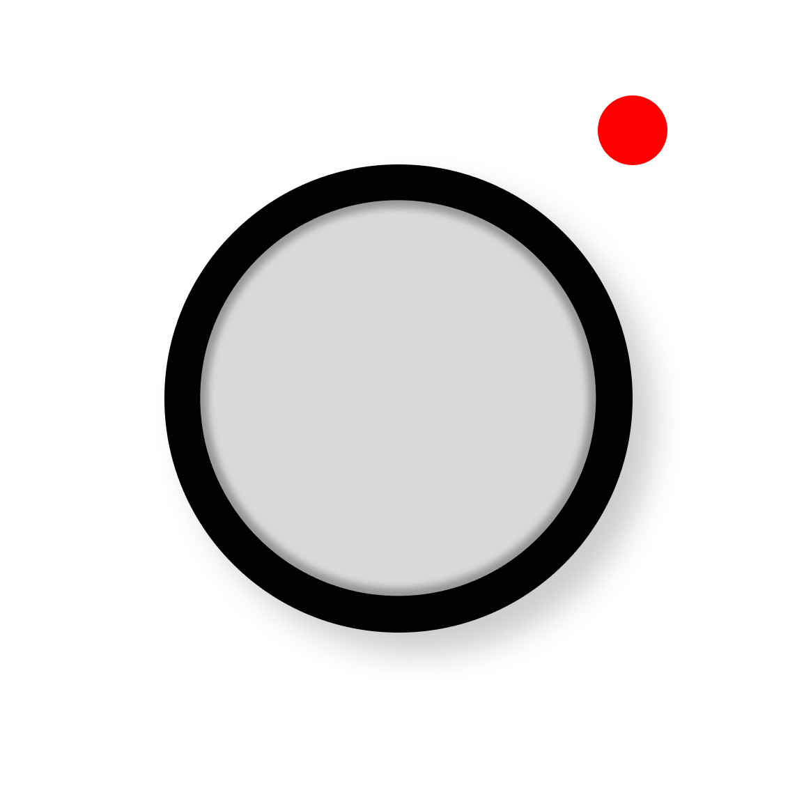

<p align="center">
  
</p>

<h1 align="center">Stable Action</h1>

<p align="center">
  <strong>Samsung Super Steady Horizon Lock - rebuilt for iPhone.</strong><br/>
  Samsung's Galaxy S26 Ultra has it. Now iOS does too.
</p>

<p align="center">
  
  
  
  
</p>

<p align="center">
  
</p>

---

## Overview

Samsung's Galaxy S26 Ultra ships a feature called **Super Steady with Horizon Lock** that keeps your footage perfectly level no matter how much you tilt or shake the phone. It's one of the most impressive stabilisation tricks in mobile cameras right now - and it was exclusive to Android.

**Stable Action brings that exact same experience to iOS.** Point it at anything, tilt your wrist, run, jump, ride - the horizon stays locked flat, just like on the S26 Ultra. Built entirely in native Swift, runs 100% on-device, no subscriptions, no cloud.

---

## Inspired by Samsung Super Steady Horizon Lock

The Galaxy S26 Ultra's Horizon Lock works by cropping into the sensor and counter-rotating that crop window against the phone's tilt in real time. The result is a video where the horizon never moves, even when the phone is spinning in your hand.

Stable Action replicates this using the exact same principle - gyroscope-driven counter-rotation, a floating crop window inside a larger sensor buffer, and hardware ISP stabilisation layered on top. It also adds **translation correction** (up/down/left/right drift compensation) that Samsung's version doesn't publicly advertise.

---

## Features

| | Feature | Details |
|---|---|---|
| 🎯 | **Horizon Lock** | Gyroscope-driven crop counter-rotation at 120 Hz |
| 📐 | **Translation Correction** | Accelerometer-based X/Y drift stabilisation |
| 🔧 | **Hardware Stabilisation** | ISP `.cinematicExtendedEnhanced` in Action Mode |
| 👁 | **Preview = Recording** | Same pipeline for both - no surprises |
| 📷 | **Normal Mode** | Full-frame, no crop, standard camera feel |
| 🎬 | **Action Mode** | Full Horizon Lock + translation + aggressive ISP |
| 🎯 | **Tap to Focus** | Lock focus and exposure to any point on screen |
| 💾 | **Auto Save** | Saves to Photos library automatically on stop |

---

## How it works

### The horizon rectangle

In Action Mode you're not seeing the full sensor frame. You're looking through a cropped **3:4 portrait window** floating in the middle of the sensor output. That window is intentionally smaller than the full frame - the surrounding space is the buffer the stabilisation uses to rotate and shift without ever hitting the edge.

Picture a picture frame floating inside a larger canvas. When the canvas tilts, the frame stays upright.

### Two corrections, every frame

**Roll correction** - the phone tilts, the crop window rotates the opposite direction by the exact same amount. They cancel out. The horizon stays flat. This is the core of what Samsung calls Horizon Lock.

**Translation correction** - the phone jerks sideways or up/down, the crop window slides the opposite way to compensate. The accelerometer detects the movement, integrates it into a velocity, and shifts the window against it. When movement stops, the window drifts back to centre automatically.

### Hardware on top

Stable Action also engages the iPhone's built-in ISP stabilisation on every frame. Hardware cleans up micro-jitter - hand tremor, footstep impact, engine vibration. Software handles the macro roll. The two layers stack.

### Normal vs Action Mode

| | Normal Mode | Action Mode |
|---|---|---|
| **Preview** | Full sensor frame | Stabilised 3:4 crop |
| **Roll correction** | ✗ | ✓ |
| **Translation correction** | ✗ | ✓ |
| **Hardware ISP** | `.auto` | `.cinematicExtendedEnhanced` |
| **Recorded area** | Full frame | Stabilised crop only |

---

## Usage

```
1. Open the app                    → camera starts in Normal mode
2. Toggle Action Mode              → Horizon Lock pipeline activates
3. Tilt the phone                  → horizon stays locked flat
4. Tap anywhere                    → locks focus + exposure to that spot
5. Press the red button            → starts recording (REC pulses at top)
6. Press again                     → stops, saves to Photos automatically
7. Tap the thumbnail (bottom-left) → plays back the last clip in-app
```

---

## Installation

> **No App Store required.** Download the `.ipa` directly from the [Releases page](https://github.com/scienceLabwork/Stable-Action/releases) and sideload it onto your iPhone using one of the methods below.

### Method 1 — AltStore (recommended, free)

1. Install **[AltStore](https://altstore.io)** on your Mac or PC and follow its one-time setup guide to install the AltStore companion app on your iPhone.
2. Download **`StableAction_1.0.ipa`** from the [latest release](https://github.com/scienceLabwork/Stable-Action/releases/latest).
3. Open the `.ipa` file on your iPhone (tap *Share → AltStore → Install App*), **or** drag the `.ipa` onto the AltStore window on your computer.
4. AltStore will sign and install the app. Once installed, open **Stable Action** from your home screen.

> AltStore re-signs the app automatically every 7 days as long as your iPhone is on the same Wi-Fi network as the AltStore desktop app.

### Method 2 — Sideloadly (free, Windows & Mac)

1. Download and install **[Sideloadly](https://sideloadly.io)** on your computer.
2. Download **`StableAction_1.0.ipa`** from the [latest release](https://github.com/scienceLabwork/Stable-Action/releases/latest).
3. Connect your iPhone to your computer with a USB cable and trust the computer when prompted.
4. Open Sideloadly, drag the `.ipa` into the window, enter your Apple ID, and click **Start**.
5. On your iPhone go to **Settings → General → VPN & Device Management**, tap your Apple ID, and tap **Trust**.
6. Open **Stable Action** from your home screen.

> Like AltStore, Sideloadly apps expire after 7 days with a free Apple ID and must be re-signed. A paid Apple Developer account ($99/year) extends this to 1 year.

### Troubleshooting

| Problem | Fix |
|---|---|
| "Untrusted Developer" alert | Settings → General → VPN & Device Management → Trust your Apple ID |
| App crashes on launch | Make sure you are on **iOS 16 or later** |
| Install fails in Sideloadly | Try a different USB cable or port, or restart Sideloadly |
| AltStore can't find the app | Ensure iPhone and Mac/PC are on the same Wi-Fi network |

---

## Requirements

- iPhone with iOS 16 or later
- iOS 18 or later for best Action Mode stabilisation
- Physical device required - camera and gyroscope unavailable in Simulator

---

## Permissions

| Permission | Why |
|---|---|
| **Camera** | To capture video |
| **Microphone** | To record audio alongside video |
| **Photos** | To save finished clips to your library |

---

## Support

If you find this project useful, consider buying me a coffee ☕

<p align="center">
  <a href="https://buymeacoffee.com/rudrashah">
    
  </a>
</p>

---

## Credits

Designed and built by **[Rudra Shah](https://rudrahsha.in)**

---

<p align="center">
  <sub>Built for iPhone · Inspired by Samsung Galaxy S26 Ultra Super Steady Horizon Lock</sub>
</p>
